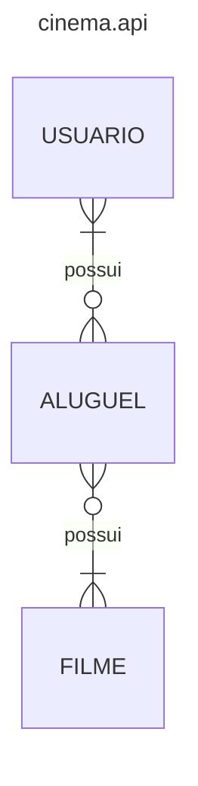

Olá, seja bem-vindo(a) ao cinema.api. Essa aplicação é responsável por propor 
a estruturação e funcionamento da integração entre microserviços, com o intuito 
de fornecer informações sobre filmes, usuários e suas relações.
A aplicação tem como base em sua arquitetura a ideia de portas e seus adaptadores
, comumente conhecida como Ports and Adapters ou Hexagonal Architecture. A ideia
da arquitetura é realizar a inversão de dependência na tomada de decisão das
implementações, criando assim contratos (portas) que se comunicam com o ambiente 
externo, podendo assumir diferentes implementações (adaptadores). Isso fornece 
maior facilidade em criação de testes e torna a aplicação menos acoplada.

Além da estruturação de arquivos, temos também a arquitetura de microserviços, 
responsável por propor a atomicidade das aplicações e sua independência, evitando
que um problema em um determinado serviço, causa consequências em algum outro, como
pode ocorrer em monolitos. 

Para essa aplicação, foram separados 3 (três) microserviços, sendo eles:

- Filme
- Usuário
- Aluguel

Portanto, sempre que um usuário for criado, alterado ou excluído, o serviço de
aluguel será notificado para manter a consistência de informações. Observe o diagrama
abaixo para um melhor entendimento das relações.

A aplicação contará com 3 apis, uma para cada serviço, como também de um sistema
de mensageria para comunicação assíncrona e através de eventos.
